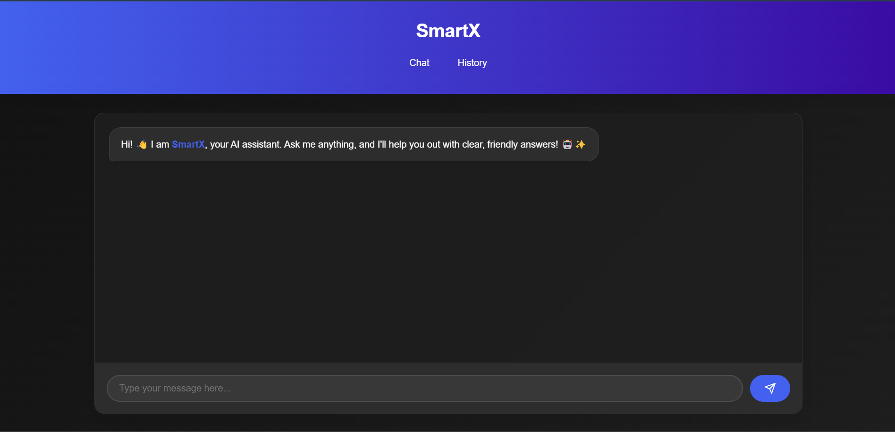
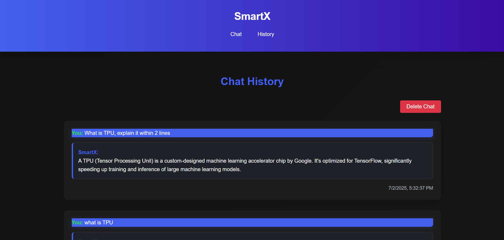

# SmartX AI Chatbot

SmartX is a modern, full-stack AI chatbot web application powered by Google Gemini. It features persistent chat history, Markdown/HTML rendering, and a beautiful, responsive UI. Built with Node.js, Express, EJS, and SQLite.

---

## 🚀 Features
- **Conversational AI**: Powered by Google Gemini (Gemini 1.5 Flash)
- **Markdown & Table Support**: AI answers support bold, italics, code, tables, and more
- **Persistent Chat History**: All chats are saved and viewable in a dedicated history page
- **Start New Chat**: Easily clear chat history and start fresh
- **Responsive UI**: Works on desktop and mobile
- **Beautiful Design**: Modern CSS, dark mode support, and smooth animations
- **.env Support**: Keep your API keys and secrets safe

---

## 🖥️ Screenshots




---

## ⚙️ Installation & Local Setup

1. **Clone the repository:**
   ```bash
   git clone https://github.com/Chandan-Chetia/SmartX-AI.git
   cd SmartX-AI/gemini-bot-website
   ```
2. **Install dependencies:**
   ```bash
   npm install
   ```
3. **Configure environment variables:**
   - Copy `.env.example` to `.env` and fill in your [Google Gemini API key](https://ai.google.dev/)
   - Example:
     ```env
     GEMINI_API_KEY=your-gemini-api-key-here
     PORT=3000
     ```
4. **Start the app:**
   ```bash
   node index.js
   ```
   The app will run at [http://localhost:3000](http://localhost:3000)

---

## 🌐 Deployment (Recommended: Render)

1. **Push your code to GitHub**
2. **Go to [Render](https://render.com/)**
3. **Create a new Web Service**
   - Connect your GitHub repo
   - Build command: `npm install`
   - Start command: `node index.js`
   - Add your environment variables (`GEMINI_API_KEY`, `PORT`)
4. **Deploy!**
   - Render will give you a public URL to share your app

---

## 📝 Project Structure

```
gemini-bot-website/
├── public/
│   ├── css/
│   ├── js/
│   └── ...
├── views/
│   ├── index.ejs
│   ├── history.ejs
│   └── partials/
├── chatHistory.db         # SQLite database
├── index.js               # Main server file
├── package.json
├── .env
└── ...
```

---

## 🛡️ Security & Best Practices
- **Never commit your `.env` file** (API keys/secrets)
- `.gitignore` is set up to ignore `node_modules/` and `.env`
- Use HTTPS in production
- For production, use a managed database (Render, Railway, etc.)

---

## 🙏 Credits
- [Google Gemini API](https://ai.google.dev/)
- [Express.js](https://expressjs.com/)
- [EJS](https://ejs.co/)
- [Marked.js](https://marked.js.org/)
- [Render](https://render.com/) (recommended deployment)

---

## 📄 License

MIT License. See [LICENSE](./LICENSE) for details.

---

## 💡 Author

**Chandan Chetia**  
[GitHub](https://github.com/Chandan-Chetia)
